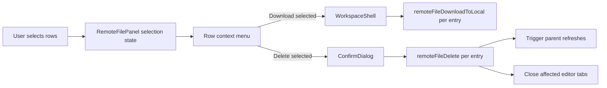

# Remote file multi-select and bulk actions design

## Scope

Implement remote file multi-selection in the React file tree and reuse existing single-entry backend commands for delete/download. No new Tauri batch command is planned unless implementation discovers a blocker.

## Architecture

### Selection ownership

`RemoteFilePanel` owns selection state because selection is a view concern tied to the currently rendered tree, the active connection, and visible rows. The parent `WorkspaceShell` should receive selected entries only when a bulk action is invoked.

The selection model stores entries by normalized remote path:

```ts
Record<string, RemoteFileEntry>
```

This preserves the entry kind/name needed for delete/download actions and avoids relying on stale row indices after directory expansion changes.

### Visible row ordering

`renderRows` already flattens directory entries recursively. Introduce a lightweight flattened-row list derived from visible entries and expanded directories so Shift range selection can operate on the same row order the user sees.

### Interaction rules

- File row click selects that file.
- File row double-click still opens the file.
- Plain directory row click keeps existing behavior: expand/collapse and set active directory.
- `Ctrl`/`Meta` click on a directory row toggles selection without expanding/collapsing.
- `Shift` click on any row selects the visible range from the last selection anchor to that row.
- Context-menu opening on an unselected row should make that row the single selection, matching desktop file manager behavior.
- Context-menu opening on a selected row preserves the current selection and shows bulk actions.
- Selection resets on connection change.

### Context menus

When more than one entry is selected and the current entry is part of that selection, replace the single-entry menu with:

- Download selected
- Delete selected
- Clear selection

Single-entry actions such as rename, copy path, and properties remain available for a single selected entry. A selected row should not mix multi-selection actions with single-entry actions once the selection contains multiple entries.

Blank-area context menu should not expose bulk actions unless the implementation can reliably preserve a current selection without confusing the target directory menu. Prefer row context menu for selected-entry actions.

### Parent callbacks

Extend `RemoteFilePanel` props with optional bulk callbacks:

```ts
onDeleteEntries?: (entries: RemoteFileEntry[]) => void;
onDownloadEntries?: (entries: RemoteFileEntry[]) => void;
```

Keep existing `onDeleteEntry` and `onDownloadEntry` for single-entry actions.

### WorkspaceShell integration

Bulk download can call existing `runRemoteFileDownload(entry)` once per selected entry. This preserves the current transfer list, progress, retry, conflict handling, file/directory behavior, and cancellation.

Bulk delete needs a new pending target shape that can represent one or many entries. Confirmation should summarize count and include open/dirty editor tab warnings across all selected entries. On confirmation, delete entries sequentially through `remoteFileDelete`, passing `recursive` for directories. After deletion:

- Refresh every affected parent directory once.
- Close tabs under any deleted entry.
- Clear pending close/conflict ids if their tabs were removed.
- Activate fallback tab if the active editor tab was removed.

## Data Flow



## Compatibility

- Existing single-entry context menu actions should remain available.
- Existing directory click behavior must not regress.
- Existing file double-click open behavior must not regress.
- Existing drag/drop upload target behavior must remain intact.
- Backend command contracts remain unchanged.

## Risks

- Row click and double-click can conflict if click selection fires before double-click open. This is acceptable for files if double-click still opens; avoid triggering destructive actions on click.
- Shift range selection depends on visible row order; recompute from current rendered tree rather than keeping a stale row list.
- Deleting nested selected paths can produce redundant delete attempts if both a parent directory and its child are selected. Implementation should collapse delete requests by removing entries that are strict descendants of another selected directory before invoking backend deletes.
