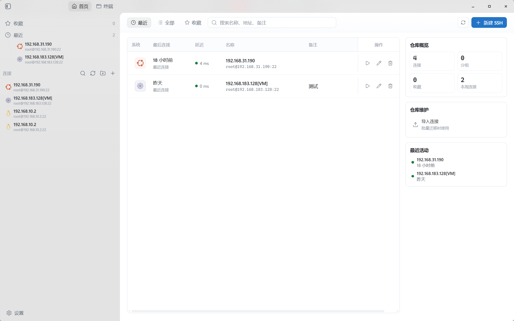
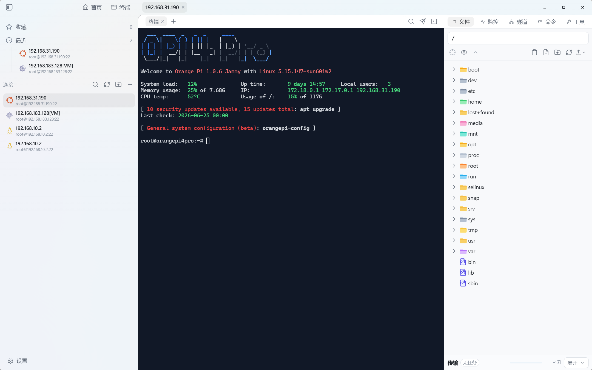
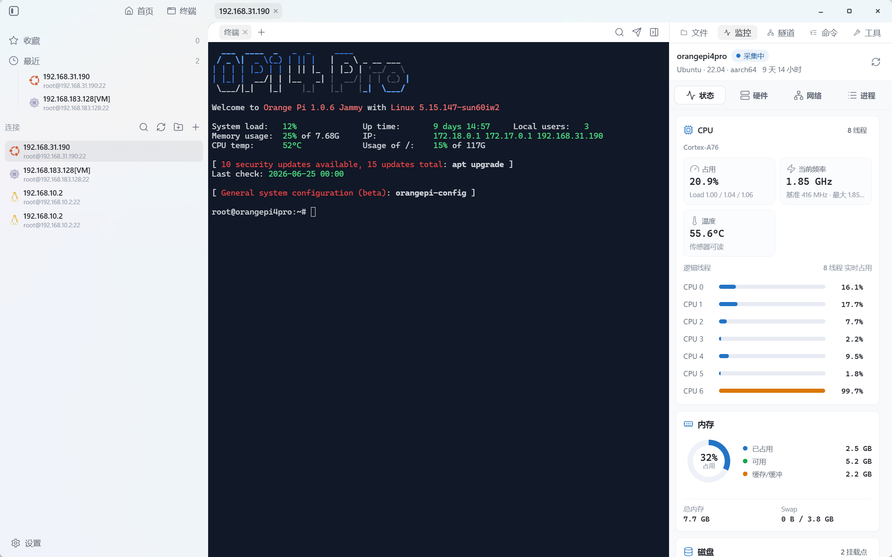

# mXterm

[](https://github.com/syscryer/mxterm/releases)
[](https://github.com/syscryer/mxterm/actions/workflows/release.yml)

mXterm 是一个基于 Tauri v2、React 和 Rust 的个人桌面运维客户端，目标是把 SSH 终端、SFTP 文件管理、传输队列、远程文件编辑、连接仓库和主机监控放到一个轻量的本地应用里。

项目运行时不依赖 Node/Express 本地服务，也不做 `with-node` / `no-node` 分发分支。前端负责桌面交互，SSH、SFTP、本地存储和跨平台能力由 Rust/Tauri 承载。

## 截图

| 连接仓库 | 终端与 SFTP 文件 |
|---|---|
|  |  |

| 终端与主机监控 | 外观设置 |
|---|---|
|  |  |

## 功能概览

- 连接管理：本地 SSH 连接仓库、最近连接、收藏、搜索和快速启动。
- SSH 终端：多连接、多标签、xterm.js 渲染、基础终端配置和断线状态保留。
- SFTP 文件：远程目录浏览、上传下载、拖拽上传、重命名、删除和目录操作。
- 传输队列：上传下载进度、速度、状态、取消、失败重试和完成清理。
- 远程编辑：面向文本文件的 Monaco 编辑器、未保存提示、保存冲突检查和查找替换。
- 工作区工具：主机监控、端口隧道、命令工具、文件工具和传输状态入口。
- 应用设置：外观密度、窗口材质、强调色、字体、快捷键、本地终端和同步配置。
- 自动更新：GitHub Release 上的 Tauri updater metadata，桌面安装版可在应用内检查更新。

## 下载

正式发布只走 GitHub Release：

- [GitHub Releases](https://github.com/syscryer/mxterm/releases)
- [最新版本](https://github.com/syscryer/mxterm/releases/latest)

当前发布主线：

| 平台 | 产物 | 应用内更新 |
|---|---|---|
| Windows x64 | NSIS 安装包、绿色版 zip | 仅 NSIS 安装版 |
| macOS Apple Silicon | Apple Silicon 安装/下载资产 | 支持 |
| Linux x64 | AppImage、deb、rpm | 仅 AppImage |

首版不发布 macOS Intel。Windows 绿色版和 Linux deb/rpm 作为手动下载资产保留，不写入 `latest.json` 自动更新目标。

## 开发

推荐在 Windows 上开发和验证。需要提前安装 Node.js、pnpm、Rust 和 Tauri 所需系统依赖。

```powershell
pnpm install
pnpm tauri:dev
```

常用检查命令：

```powershell
pnpm check
pnpm test:release
```

平台打包入口：

```powershell
pnpm package:win
pnpm package:mac-arm64
pnpm package:linux
pnpm package:all
```

## 发布流程

本仓库只配置 GitHub Release 发布渠道，目标仓库为 `syscryer/mxterm`。正式发布由 `v*` tag 触发，`workflow_dispatch` 手动触发只做完整构建、资产整理、`latest.json` 和校验文件验证，不创建 GitHub Release。

发布前需要保证三个版本号一致：

- `package.json`
- `src-tauri/Cargo.toml`
- `src-tauri/tauri.conf.json`

GitHub Secrets：

- `TAURI_SIGNING_PRIVATE_KEY`：必填，Tauri updater 私钥内容。
- `TAURI_SIGNING_PRIVATE_KEY_PASSWORD`：可选，私钥密码。

发布步骤：

```powershell
git status --short
git tag v0.1.0
git push origin v0.1.0
```

Release workflow 会构建 Windows x64、macOS Apple Silicon 和 Linux x64，并生成平台安装包、源码 zip、源码 tar.gz、`latest.json` 和 `SHA256SUMS.txt`。Windows 代码签名、macOS Developer ID 签名和 notarization 暂未接入，workflow 中保留后续扩展入口。

## 项目文档

- [需求文档](docs/requirements/m-xterm-requirements.md)
- [宽松协议开源项目参考](docs/research/permissive-open-source-references.md)
- [MVP 工程基座与 SSH Spike 计划](docs/plans/2026-06-05-mxterm-mvp-foundation-and-ssh-spike.md)
- [Storage / Security / Sync Foundation 计划](docs/plans/2026-06-20-storage-security-sync-foundation.md)

## Trellis

后续项目开发使用 [Trellis](https://docs.trytrellis.app/zh) 管理。

当前仓库已通过 `trellis init --codex -u MNL --yes --skip-existing --workflow native` 初始化：

- `.trellis/`：共享工作流、规范、任务和项目记忆。
- `.codex/`：Codex hooks 和 Trellis agent 配置。
- `.agents/skills/`：Trellis 技能说明，供 Codex、Cursor、Gemini CLI 等工具读取。

常用命令：

```powershell
trellis --version
python ./.trellis/scripts/task.py list
python ./.trellis/scripts/task.py current --source
python ./.trellis/scripts/get_context.py --mode packages
```

Codex hooks 需要用户级 `~/.codex/config.toml` 启用 `features.hooks = true`，并将本项目设置为 trusted。

## 许可

当前仓库尚未加入 `LICENSE` 文件。正式公开前建议补充明确的开源许可证。
